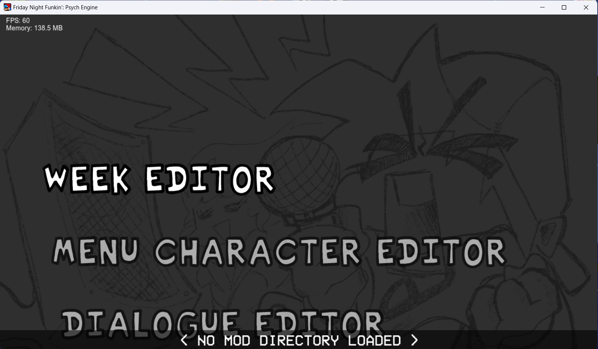
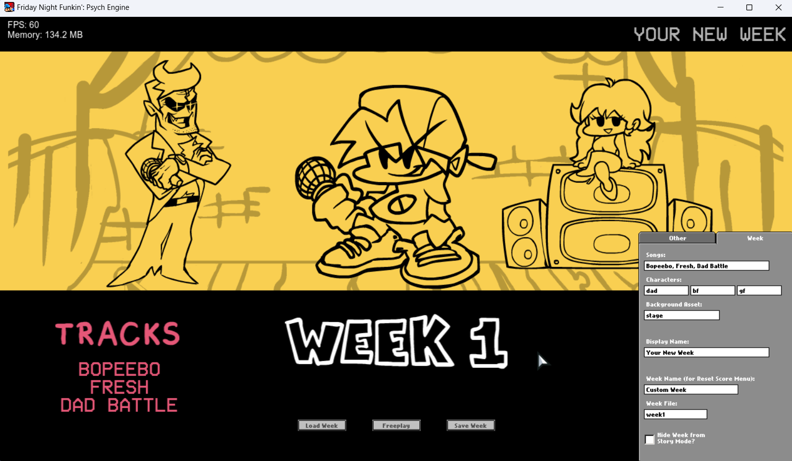
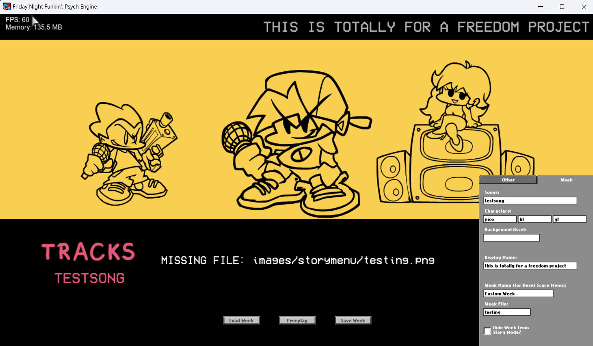
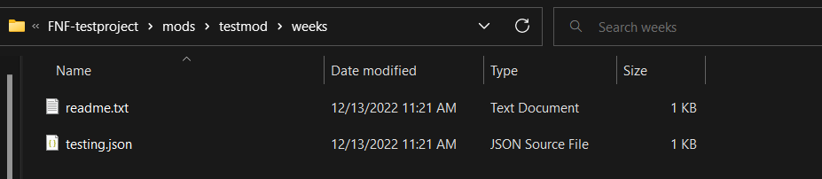
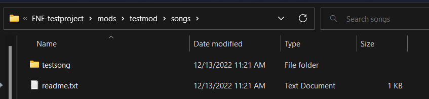
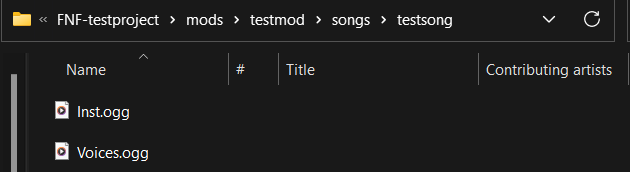
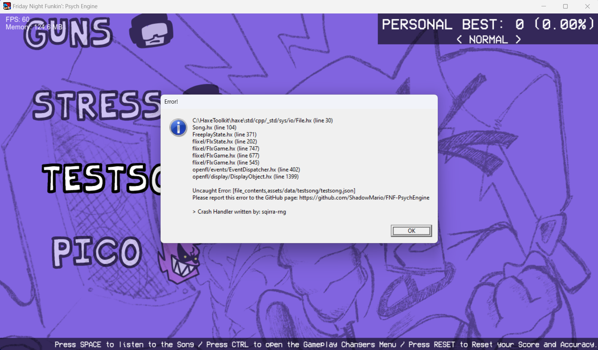
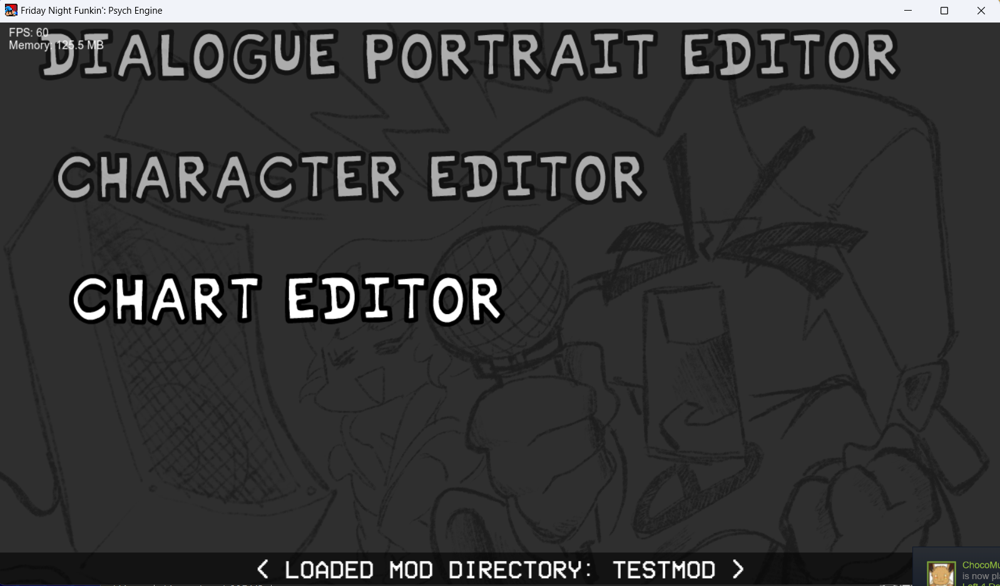
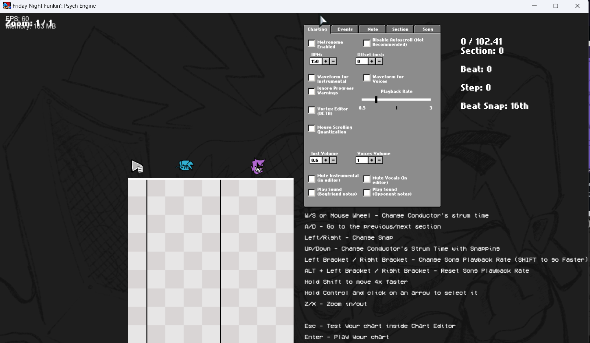

# Entry 2
Getting to know the Psych Engine 12/17/2022

So I'm at the point of tynkering with Psych Engine. I learned quite a bit and I want to share my experience with you.

After following a [psych engine tutorial](https://youtu.be/qxMyoudrFPs) made by BB--panzu. I learned how many things work around psych engine. I decided that I don't mess around with the sprite sheet yet since I don't have the material to tynker with that yet. I am planning to [collab](https://hstatsep.github.io/students/#skills) with Dice to make a character and converting it into a sprite sheet. 

I want to talk about 3 parts of what I experienced so far. The week editor, the chart editor, and the song. 

## The Week Editor

Your modding first starts here with the week editor. You won't get anywhere without it. 

When you boot up Friday Night Funkin, you will see your average music game with a lot of menu buttons. But we aren't here for that, we want to make a mod. The first step you want to do is right after you press **ENTER**, you want to press **7**. This will bring up the editor.

Then you want to press the week editor here. We don't want to do anything else first. 

Now it may look intimidating at first but it is very simple to break down but we are most interested in the song tab. 

For our testing, we will only use one song for now. If you add more songs into the week, once the first song is done then the second song goes up. 

For the song here, we will put `testsong` as our song. The rest we can pretty much mess around here like the `Display Name` and the `Characters`.

Then after that is done, we can press **Load Week** and save it into the `Weeks` folder and then we can move on to the songs. 

## The Song

The song is pretty interesting. It is split up into 2 parts. The instrument and the vocals.

The intrument is explanatory. It is the instrumental of the song and the vocals are the voices are the songs. The reason why they are seperated is because if the player misses a note, then the vocals will be cut off for a split second. 

Now for my tynkering, I decided to use [jummbox](https://jummbus.bitbucket.io) for my testing for my instrumental. This was recommended by the Friday Night Funkin Modding Community for beginners. 

For the vocals, I decided to use a random sound effect as I haven't watched the tutorial on making vocals yet. I am planning to use this [tutorial](https://youtu.be/pc8c-A0AJX4) I found by doing some [research](https://hstatsep.github.io/students/#skills). 

So now where do you get to place it? Well I'm glad you ask. Assuming you go into your mod dictionary and into your created mod folder, you would want to go into the `songs` folder.

Then you would have to name your song folder. This is very important cause the same name has to be used for the charting. 

The final step is just adding it into your song folder. The engine **only** accepted `.ogg` files and they have to be named `Inst.ogg` for instrument of the song and `Voices.ogg` for the vocals of the song. This is where [Audacity](https://www.audacityteam.org) comes in and helps converting any song into .ogg files. 

## The Chart Editor

So now we have the week and the songs in right? Surely we can play our songs right?

**WRONG!** If you try to load up the week or the song in freeplay, Psych Engine will crash. This is because the song in question does not have a chart. 

This is what you will see...

So we need to make the chart right? Well if we go back into the editor menu, we need to scroll down into the chart editor. We also need to make sure that the engine knows the current dictionary. In my case, this would be `testmod`.

Once were in the chart editor, we are greeted with this chart editor. Psych Engine makes the charting easier compared to the stock charter.

Now here we see 3 sides of the chart editor. The first one with the Play button and a paper is where the scriping goes. If it reaches that point, then a lua command is runned. The second and third one is where our music happens. 

The second one (The one with the blue boy icon) is where the player must hit their notes and the third one (One with the Grinny purple boy) is the opponents notes. Note that the opponent notes will hit basically every note along its path. 

[Previous](entry01.md) | [Next](entry03.md)

[Home](../README.md)