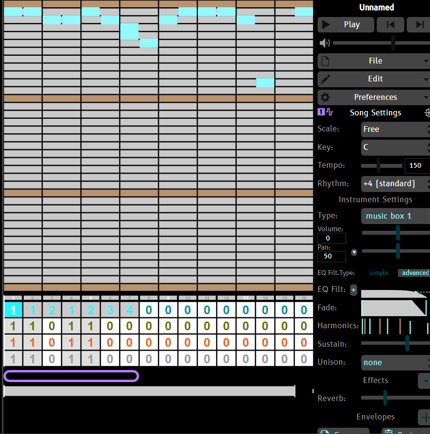

# Entry 3
## The choice of Music Software 02/10/2023

I finally chose my topic for my Friday Night Funkin mod. Although it took me a lot of doubting and decision making of what my mod should be about, I decided that I should stick to something simple. For this Mod, I will use one of my characters that I created when doing digital art. 

Now that my topic of the mod was settled it was time for the plan. My plan for this is to make one music, one chart, one character, and one unique sequence as part of the MVP.

Lets start off my journey with finding a music software that I will be using. The first [Jummbox](https://jummbus.bitbucket.io) which is a free in-browser music maker. Although it does make music, it was pretty barebones as it only has a select instruments and the layout is a bit confusing. 

Eventually I stopped using this and moved on to FL studio by Image Line Software. I've seen people used [FL studio](https://www.image-line.com) for most of their Friday Night Funkin mods so this should be great news. Although theres a 30 day trial period, I surely can get some use of it. 

Problems arise when I used it. It is basically borderline confusing and annoying. I had a tiny bit of experience of how music software functions but FL studio gave me so many problems that it took me at least 3 days to give up on it.

The first problem I see with FL studio is that there is so much clutter everywhere. To a beginner, I have no idea where to start at all. Despite the fact I watched a tutorial on FL studio, I still cannot get my head wrapped around how the thing functions. The layout is confusing.

The most annoying part is undoing certain actions. Normally when you undo with `CTRL + Z` you can press it how many times you want until you want it to stop. In FL studio, it will undo only one action. Pressing `CTRL + Z` will bring back that undo the action. Not only that, but there are so many workarounds with Fl studio that it is just not worth learning.

This brought me to [Garageband](https://www.apple.com/mac/garageband/) which is a free apple music software. 

**image here**

[Previous](entry02.md) | [Next](entry04.md)

[Home](../README.md)