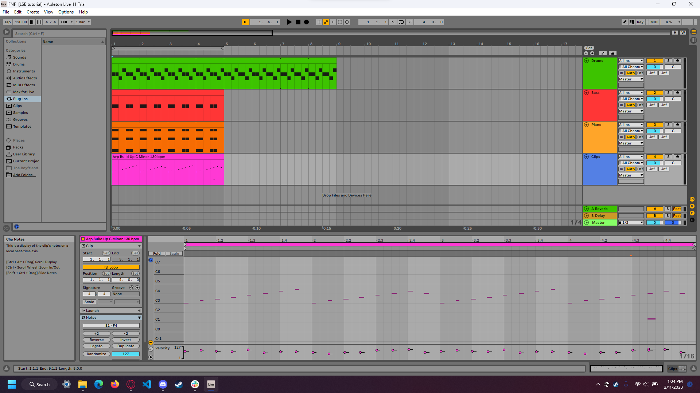

# Entry 3
## The choice of Music Software 02/10/2023

I finally chose my topic for my Friday Night Funkin mod. Although it took me a lot of doubting and decision making of what my mod should be about, I decided that I should stick to something simple. For this Mod, I will use one of my characters that I created when doing digital art. 

Now that my topic of the mod was settled it was time for the plan. My plan for this is to make one music, one chart, one character, and one unique sequence as part of the MVP.

Lets start off my journey with finding a music software that I will be using. The first [Jummbox](https://jummbus.bitbucket.io) which is a free in-browser music maker. Although it does make music, it was pretty barebones as it only has a select instruments and the layout is a bit confusing. 

Eventually I stopped using this and moved on to FL studio by Image Line Software. I've seen people used [FL studio](https://www.image-line.com) for most of their Friday Night Funkin mods so this should be great news. Although theres a 30 day trial period, I surely can get some use of it. 

Problems arise when I used it. It is basically borderline confusing and annoying. I had a tiny bit of experience of how music software functions but FL studio gave me so many problems that it took me at least 3 days to give up on it.

The first problem I see with FL studio is that there is so much clutter everywhere. To a beginner, I have no idea where to start at all. Despite the fact I watched a tutorial on FL studio, I still cannot get my head wrapped around how the thing functions. The layout is confusing.

The most annoying part is undoing certain actions. Normally when you undo with `CTRL + Z` you can press it how many times you want until you want it to stop. In FL studio, it will undo only one action. Pressing `CTRL + Z` will bring back that undo the action. Not only that, but there are so many workarounds with Fl studio that it is just not worth learning.

This brought me to [Garageband](https://www.apple.com/mac/garageband/) which is a free apple music software. Since I had imacs in the computer lab and at home, this was pretty accessible since I can transfer the file once I'm done with my period of SEP. 

Garageband was nice and it was possible to make a Friday Night Funkin song but there weren't a lot of tutorials for it and only a select few only use it. So far, I seen 
[Mising0pX](https://www.youtube.com/watch?v=NiSGXkodsek) used Garageband for their song and a couple of others but thats it. No tutorials or anything.

But then I remember something. I recalled someone who is very good at specializing in music and makes tutorial for beginners.

[Longestsoloever](https://www.youtube.com/@longestsoloever) is a music producer and once a teacher makes [tutorial](https://www.youtube.com/watch?v=m_LkC-liYkc&list=PLfb6KneL63QsQ58tj-RkDCHRmheAofPJj) for people who are starting music production. His tutorials are great and he recommends [Ableton Live](https://www.ableton.com/en/live/) for new music producers. Since then, I was stunned with how generous Ableton is. Of course it isn't free but it gives you a **90 Day free trial**. When I first saw this I was stunned. FL studio was a 30 day free trial but Ableton really wants their beginners to get into music production. 

Once I followed Longestsoloever tutorial, I wanted to tynker with the software and make something that I would actually like in my mod. Here is what I have currently.

While I was working on this, I stumbled across DelFino. Delfino was one of the teachers who is currently teaching Music at HSTAT. Since then, he came back into the building to come back teaching. We met each other in the lunchroom and he told me about Ableton Lite. He told me that it is free and should use it once my free trial period expires. He even told me to message him for more Ableton tutorials. I was glad that I talked to him and I hope I can make some music that will fit nicely with my mod.

This music journey was just the start but I've learned so much. I had research a music software that I can condifently use and make sure it lived up to expectations. Now that I found my software, I can finally start creating music. 

But I can't rest yet, I still have to do the Art and coding before I get too relaxed. To prevent any more time wasting, I managed my time using the reminder app on my phone to keep me on pace.

And that is pretty much the start of the music journey here. See you for the result then!

[Previous](entry02.md) | [Next](entry04.md)

[Home](../README.md)