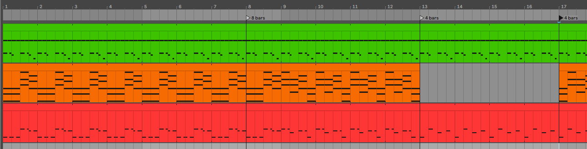

# Entry 4
## Lets make some music shall we 3/14/2023

After entry 3, I decided to make the instrumentals before I move on to the vocals of my music. Since I'm on my MVP stage of my project, one song is enough before I move on to something more insane like an entire week consisting of 3 songs.

So far, I have been trying to make the instruments good sound as possible while keeping the songs 4/8/16 bars long for consistancy. There is a reason why it has to be this way since most FNF songs need to take half the amount for the vocals on your opponent and you as well. Having a odd amount of bars will lead to bad sounding vocals that will sound very off from the instrumental. 



You can see that when I reach my desired bar limit, I change part of the song. This is to prevent the music from sounding repetitive. This is a part of [Music theory](https://hstatsep.github.io/students/#skills), a skill that I am trying to be good at. Music theory allows me to understand what instruments fit well with the current piece I'm trying to create as well as how it teaches me how music is written as a whole.

While working on my music, I was also getting [better at using Ableton](https://hstatsep.github.io/students/#skills). When I was creating and learning about music theory, I felt like Ableton was basically second nature to me. Knowing how a software works can be crutial as it can shift how well you can do since you are basically at the programs mercy to give you something easy to learn. When I was working with FL studio, I felt like the program was difficult for me to learn but I was able to quickly switch out of FL studio. When I was working with Ableton however, thanks to LongestSoloEver, I was able to understand what FL studio does and his instructions was clear compared to other FL studio tutorial. Choosing your program is subjective and there is no right answer what program is the best, it is just whichever feels more comfortable and easy for the person.

I've also watched another [LongestSoloEver's tutorial](https://youtu.be/hS7twgQOUvc?list=PLfb6KneL63QsQ58tj-RkDCHRmheAofPJj) which is how to write songs. This is how I know about the 4/8/16 bar rule. I've also seen what he does with his piano track as well as his bass. I also try to apply that concept here as well. I've also learned Song structure which is part of Music theory. His good piano structures are basically...

```
1 6 4 6

1 5 6 4

6 4 5 1

6 5 4 1
```

Now you may not know what these numbers mean but it is actually very simple. These are the white keys in the piano section for each section of the piano. 


[Previous](entry03.md) | [Next](entry05.md)

[Home](../README.md)