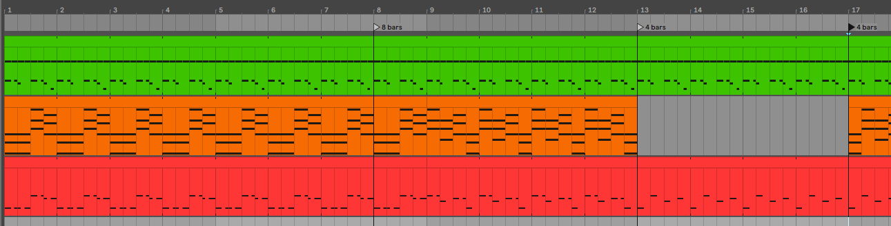
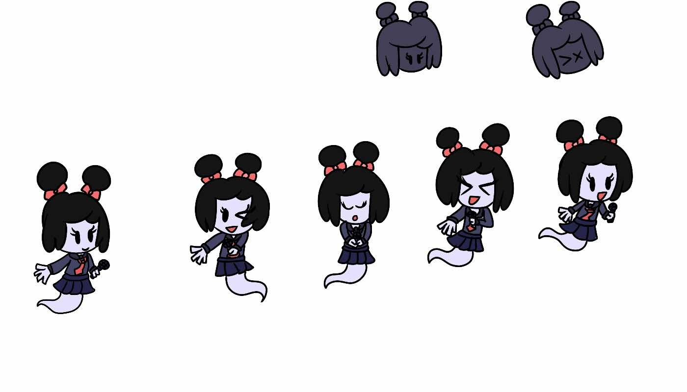
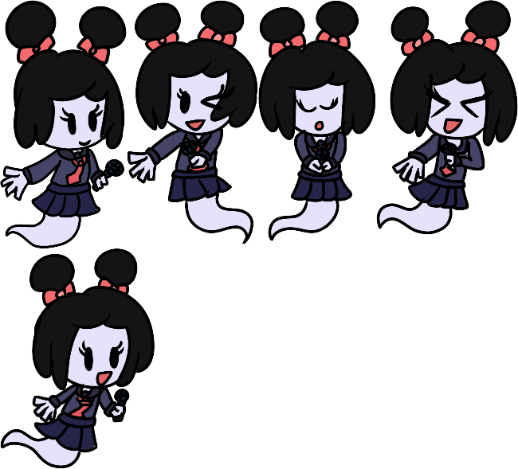
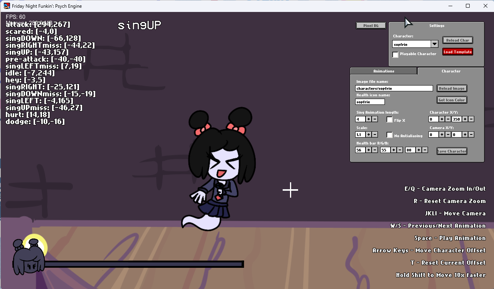
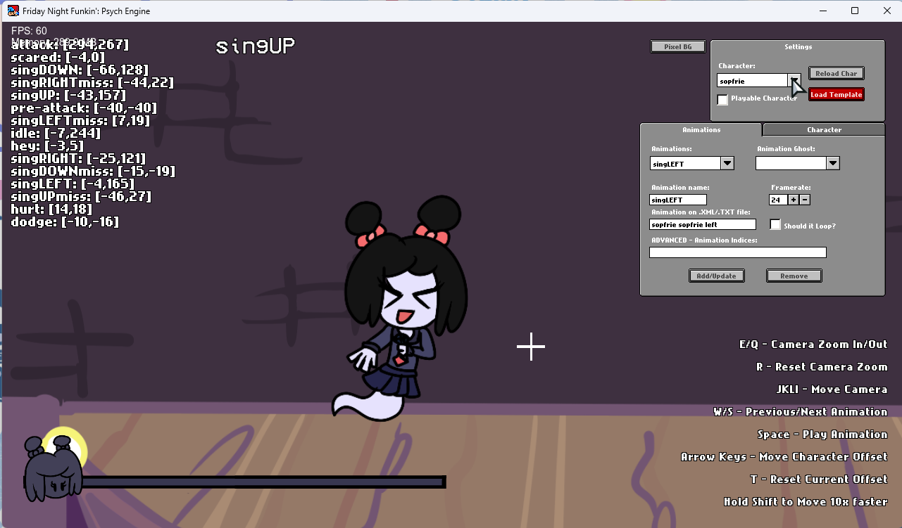

# Entry 5
## Sprites and Code. Two in one combo! 4/17/2023


### Art Section
With music finished, I got to the coding part of my freedom project. Now you may be asking. "But Aron, didn't you say that you are also gonna work on the sprites on the game? Why are you talking about coding now?". Great question fellow reader! There is a unique skill called [Collaboration](https://hstatsep.github.io/students/#skills) and [Commication](https://hstatsep.github.io/students/#skills). 

Dice is a fellow SEP member as well as a digital artist. She was the perfect candidate to ask for help. She gladly accepted to create the sprites for me. Although I could make the sprites myself, her art style surpassed me. You can just see the difference between my art style versus hers later on.

That being said, I need to also provide a character sheet to her so that is what exactly what I did. I made the base character sheet to give Dice a reference to draw. Here is what the character sheet looked like.



Once I sent this to Dice, I made a reasonable deadline for Dice so that she doesn't need to feel pressured into rushing. This is something I need to take into consideration. I need to make a deadline that is long enough so that the person helping doesn't feel rushed doing this while also not making it last minute. 

I gave her the 7th of April but gave her a week extension because she was very busy. It turned out to be the best since we got the amazing final product of the character sheet.



These look WAY nicer and Dice took my artwork and turn them into Friday Night Funkin style while maintaining parts of my Artwork. I've also asked her to turn these into transparent PNG because the next step requires transparent PNGs in order for the spritesheet converter to work. 

With the transparent PNG's, I turned over to the converter that I will be using. This is the [Spritesheet and XML generator](https://gamebanana.com/tools/7136) by [UncertainProductions](https://gamebanana.com/members/1895791). He made this tool to easily convert your sprites into a spritesheet and their XML file so that the game can read the spritesheet without needing Adobe Animate. On top of that, he uploaded a [tutorial](https://youtu.be/lcxpa7Gc3i0) on how to use his tool which I watched. Once converted, this is what it looks like.



And here is what the icons look like...


Of course, there are some issues with this. The icon image on the right is smaller than the left one and the spritesheets are missing its animation. The icon image can be a easy fix but I can pass the animation to my **Beyond MVP**, the game can function without animation. 

Surely with that out of the way, we can just place the spritesheet and the icons in their respective folders and be on our way right?

**WRONG**

You will need to edit the character in Psych Engine before using it. You will need to go into the 7 menu and press the **Character Editor** button. Once there, you are greeted with this screen.



The initial screen will have Boyfriend as default but you can change that with the **Image file name**. That will take the PNG of the spritesheet and display your character. You can also put the Health Icon in the **Health icon name**. Same concept that it will take the PNG of the spritesheet but will take the icon spritesheet. 

When you change the directory in the **Image file name** box to your respective character, you will see a error next to the animation frame [The position where it says **singUP**, It would look like **singUP (ERROR)**]

Now why is it getting an error? That is because we haven't told the game where the spritesheet position is. This is where the XML file comes in. It defines which parts of the animations are on the spritesheet. This is where we will go into the animation tab.



The sections we care about is the **Animaton** and the **Animation on .XML/.TXT file** since that is what we will be changing.

In the animation tab, we will only be chaning the following...

```
singUP
singLEFT
singDOWN
singRIGHT
```

The rest doesn't need to be changed since we aren't animating them anyways and the oppenent side isn't gonna use them anyways.We will use **SingLEFT** as our example here.

We now focus our attention to the **Animation on .XML/.TXT file** box. You see the box that is named `sopfrie sopfrie left`. That is because we need to match the name with the XML file the spritesheet cordinates to. Lets look what the XML file looks like first!

```html
<?xml version='1.0' encoding='utf-8'?>
<TextureAtlas imagePath="sopfrie.png">
<SubTexture name="sopfrie sopfrie right0000" x="0" y="312" width="194" height="277" frameX="-44" frameY="-46" frameWidth="367" frameHeight="387" />
<SubTexture name="sopfrie sopfrie up0000" x="472" y="0" width="178" height="295" frameX="-38" frameY="-66" frameWidth="263" frameHeight="427" />
<SubTexture name="sopfrie sopfrie down0000" x="324" y="0" width="148" height="303" frameX="-31" frameY="-48" frameWidth="224" frameHeight="441" />
<SubTexture name="sopfrie sopfrie left0000" x="159" y="0" width="165" height="306" frameX="-67" frameY="-97" frameWidth="310" frameHeight="491" />
<SubTexture name="sopfrie sopfrie idle0000" x="0" y="0" width="159" height="312" frameX="-68" frameY="-135" frameWidth="301" frameHeight="560" />
</TextureAtlas>
```

Pay attention to these names here, that is what we are looking for!

```
sopfrie sopfrie right0000
sopfrie sopfrie up0000
sopfrie sopfrie down0000
sopfrie sopfrie left0000
sopfrie sopfrie idle0000
```

We want to put these names in the box so that the game knows which area of the spritesheet has to grab. We also need to remove the 0's as those are unncessary.

Lets use our example here, if our animation frame is **SingLEFT** then we put `sopfrie sopfrie left` in the **Animation on .XML/.TXT file** box. We repeat this for every other cordinating animation. 

Once we complete this, we save our character and place this in our **character** folder. 

### Lua Section
[Previous](entry04.md) | [Next](entry06.md)

[Home](../README.md)