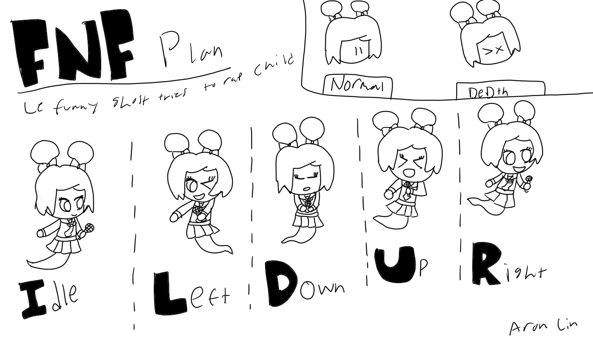

# Entry 5
## Sprites and Code. Two in one combo! 4/17/2023

## WARNING!!

Due to the sheer absurdly long blog, I've linked every chapter that is present in this blog.

[Go to "Art Section"](#art-section) | [Go to "Coding Section"](#coding-section) | [Go to "EDP"](#engineer-design-progress)

## Art Section
With music finished, I got to the coding part of my freedom project. Now you may be asking. "But Aron, didn't you say that you are also gonna work on the sprites on the game? Why are you talking about coding now?". Great question fellow reader! There is a unique skill called [Collaboration](https://hstatsep.github.io/students/#skills) and [Commication](https://hstatsep.github.io/students/#skills). 

Dice is a fellow SEP member as well as a digital artist. She was the perfect candidate to ask for help. She gladly accepted to create the sprites for me. Although I could make the sprites myself, her art style surpassed me. You can just see the difference between my art style versus hers later on.

That being said, I need to also provide a character sheet to her so that is what exactly what I did. I made the base character sheet to give Dice a reference to draw. Here is what the character sheet looked like.



Once I sent this to Dice, I made a reasonable deadline for Dice so that she doesn't need to feel pressured into rushing. This is something I need to take into consideration. I need to make a deadline that is long enough so that the person helping doesn't feel rushed doing this while also not making it last minute. 

I gave her the 7th of April but gave her a week extension because she was very busy. It turned out to be the best since we got the amazing final product of the character sheet.


These look WAY nicer and Dice took my artwork and turn them into Friday Night Funkin style while maintaining parts of my Artwork. I've also asked her to turn these into transparent PNG because the next step requires transparent PNGs in order for the spritesheet converter to work. 

With the transparent PNG's, I turned over to the converter that I will be using. This is the [Spritesheet and XML generator](https://gamebanana.com/tools/7136) by [UncertainProductions](https://gamebanana.com/members/1895791). He made this tool to easily convert your sprites into a spritesheet and their XML file so that the game can read the spritesheet without needing Adobe Animate. On top of that, he uploaded a [tutorial](https://youtu.be/lcxpa7Gc3i0) on how to use his tool which I watched. Once converted, this is what it looks like.


And here is what the icons look like...


Of course, there are some issues with this. The icon image on the right is smaller than the left one and the spritesheets are missing its animation. The icon image can be a easy fix but I can pass the animation to my **Beyond MVP**, the game can function without animation. 

Surely with that out of the way, we can just place the spritesheet and the icons in their respective folders and be on our way right?

**WRONG**

You will need to edit the character in Psych Engine before using it. You will need to go into the 7 menu and press the **Character Editor** button. Once there, you are greeted with this screen.


The initial screen will have Boyfriend as default but you can change that with the **Image file name**. That will take the PNG of the spritesheet and display your character. You can also put the Health Icon in the **Health icon name**. Same concept that it will take the PNG of the spritesheet but will take the icon spritesheet. 

When you change the directory in the **Image file name** box to your respective character, you will see a error next to the animation frame [The position where it says **singUP**, It would look like **singUP (ERROR)**]

Now why is it getting an error? That is because we haven't told the game where the spritesheet position is. This is where the XML file comes in. It defines which parts of the animations are on the spritesheet. This is where we will go into the animation tab.


The sections we care about is the **Animaton** and the **Animation on .XML/.TXT file** since that is what we will be changing.

In the animation tab, we will only be chaning the following...

```
singUP
singLEFT
singDOWN
singRIGHT
```

The rest doesn't need to be changed since we aren't animating them anyways and the oppenent side isn't gonna use them anyways.We will use **SingLEFT** as our example here.

We now focus our attention to the **Animation on .XML/.TXT file** box. You see the box that is named `sopfrie sopfrie left`. That is because we need to match the name with the XML file the spritesheet cordinates to. Lets look what the XML file looks like first!

```html
<?xml version='1.0' encoding='utf-8'?>
<TextureAtlas imagePath="sopfrie.png">
<SubTexture name="sopfrie sopfrie right0000" x="0" y="312" width="194" height="277" frameX="-44" frameY="-46" frameWidth="367" frameHeight="387" />
<SubTexture name="sopfrie sopfrie up0000" x="472" y="0" width="178" height="295" frameX="-38" frameY="-66" frameWidth="263" frameHeight="427" />
<SubTexture name="sopfrie sopfrie down0000" x="324" y="0" width="148" height="303" frameX="-31" frameY="-48" frameWidth="224" frameHeight="441" />
<SubTexture name="sopfrie sopfrie left0000" x="159" y="0" width="165" height="306" frameX="-67" frameY="-97" frameWidth="310" frameHeight="491" />
<SubTexture name="sopfrie sopfrie idle0000" x="0" y="0" width="159" height="312" frameX="-68" frameY="-135" frameWidth="301" frameHeight="560" />
</TextureAtlas>
```

Pay attention to these names here, that is what we are looking for!

```
sopfrie sopfrie right0000
sopfrie sopfrie up0000
sopfrie sopfrie down0000
sopfrie sopfrie left0000
sopfrie sopfrie idle0000
```

We want to put these names in the box so that the game knows which area of the spritesheet has to grab. We also need to remove the 0's as those are unncessary.

Lets use our example here, if our animation frame is **SingLEFT** then we put `sopfrie sopfrie left` in the **Animation on .XML/.TXT file** box. We repeat this for every other cordinating animation. 

Once we complete this, we save our character and place this in our **character** folder. 

## Coding Section

In Psych Engine, Lua is used to code scripts to trigger events in our game. ShadowMario was helpful enough to provide the [API page](https://github.com/ShadowMario/FNF-PsychEngine/wiki/Lua-Script-API) for anyone looking to code scripts into Psych Engine. 

Of course, one setback is that I don't know how to code in Lua. I've only known Javascript, Python, and HTML so far but not Lua. What am I gonna do? Is this project over! NO! We search up a solution! Thanks to youtube, I was able to find a [crash course](https://youtu.be/1srFmjt1Ib0) of Lua by [Steve's teacher](https://www.youtube.com/@Stevesteacher). 

With this information in mind, I got set into learning Lua. I made sure that I can learn the basics of Lua functions until the 8th of April and make something by the 16th of April. My [organization](https://hstatsep.github.io/students/#skills) skills came in really handy since I decided to use [Trello](https://trello.com) for my plans and to keep me dated on my deadlines. 


While learning from the crash course, I took a handful of notes down as well. This is a new language I'm learning so why not take the time to write down some notes. Who knows they maybe useful for the future.


I made this as the exact replica to what I'm familiar with as it worked for me. I've decided to stop when I reached the user inputs since what I learned before user inputs was basically the basic functions of Lua and I can learn the rest within my Beyond MVP. With this, I reached and completed my deadline on learning the basic functions of Lua. 

With Lua to my knowledge, I headed straight to making something using Lua. I only had a week to complete it so it was a good time window to try and experiment what crazy stuff I can make using Lua. 

That being said, how Psych Engine uses Lua is with functions. Each function has its own purpose as shown [here](https://github.com/ShadowMario/FNF-PsychEngine/blob/main/docs/TemplateScript.lua).

Before you start coding, you of course want to make a lua file. This lua file will trigger the entire song unless you specified it in the code itself. You want to place this in your **scripts** folder and placing the lua file there.

I've also taken the time to search up any tutorials that will help me with the coding process. Lucky for me though, there are tutorials out there made by fellow community members. I looked specifically into this playlist [here](https://www.youtube.com/playlist?list=PL60i09WIEpP0MZOzNLf1UKeYvluh8_-UQ).


I want to make something simple so I decided to make a simple text that will show the song name and who composed it. I don't want it to be very complex yet as that is saved for my beyond MVP. 

I looked into the functions list and found a specific command that will work perfectly.

```lua
function onSongStart()
	-- Inst and Vocals start playing, songPosition = 0
end
```

Once I found the functions, I took a look into the variables [list](https://github.com/ShadowMario/FNF-PsychEngine/wiki/Lua-Script-API:-Variables). Since the lua file will trigger on all the songs, I need a if statement to check if the song name matches. Thankfully, there is a variable that stores the song name which is `songName`

```
songName - Shortcut to getProperty('SONG.song')
```

With these 2 in mind, I got into working on the code and this is the result.

```lua
function onSongStart()
    if songName == "calmingdead" then
        debugPrint("Your code works!")
    end
end
```

If you are wondering, `debugPrint` works similarly to `console.log` on javascript. It will act as a miniconsole in-game. 

Now we need a text that will display on the screen of what it needs to be said. I looked into the documentation and found the [custom text documentation](https://github.com/ShadowMario/FNF-PsychEngine/wiki/LUA-Script-API:-Custom-Text). 

When generating a custom text in Psych Engine, you need to create the text using the `makeLuaText()` function. There are 5 parameters that are needed.

```
tag : What will be used to call this specific text
text : Your custom text obviously.
width : How big/small you want your text to be.
x : The x position of the text. (Follows similar rules to p5js)
y : The y position of the text. (Follows similar rules to p5js)
```

With these parameters in mind, we also want to spawn the text. We made the text but we haven't told Psych Engine to spawn it in the song. In order to spawn the text in our song, we need to use the `addLuaText` function. This function only needs one parameter which is the tag. We need to match the tag with the text we made.

```lua
function onSongStart()
    if songName == "calmingdead" then
        makeLuaText("songintro","CalmingDead by TRGGB2", 400, 800, 600)
        addLuaText("songintro")
    end
end
```

Surely with all this I am done right? Well wrong, there are 2 issues. One issue is that the text will not disappear at a certain time and the text is wayyyy to tiny.


We will first fix the simple issue which is the text size. Fortunately, there is a specific function which is `setTextSize`. This function has 2 parameters. Of course one of the parameters which is the tag and the other is the size of the text. With this in mind, we can make the text bigger!

```lua
function onSongStart()
    if songName == "calmingdead" then
        makeLuaText("songintro","CalmingDead by TRGGB2", 400, 800, 600)
        setTextSize("songintro", 30)
        addLuaText("songintro")
    end
end
```

Now to fix our last issue, we need to get rid of the text after a certain time. There is a function called `removeLuaText` but we cannot place it in our `onSongStart` because that is only triggered once and that is when the song starts. We need some kind of function that can constantly run.

Lucky for me, there is a function called `onUpdate`. This function states that it will constantly run when there is a "update" to the game but it is a function that will constantly run based on your FPS to my knowledge.

Now I need some way to remove the text at a certain time. So I went back into the variable documentation and found `curStep`. When I tested this out with debugPrint on the `onUpdate` function, it seems that it is based on the row of squares in the chart editor. I tested and created this.

```lua
function onUpdate(elapsed)
    if curStep == 30 then
        removeLuaText("songintro" , destroy == false)
    end
end
```

And if we combine this together, this is the final result.

```lua
function onSongStart()
    if songName == "calmingdead" then
        makeLuaText("songintro","CalmingDead by TRGGB2", 400, 800, 600)
        setTextSize("songintro", 30)
        addLuaText("songintro")
    end
end

function onUpdate(elapsed) -- On FPS 
    if curStep == 30 then
        removeLuaText("songintro" , destroy == false)
    end
end
```

Although its short, I think this proves that I could do way more with the Psych Engine. With this set and pushed onto github, the MVP is completed. 

## Engineer Design Progress

I'm currently at the 8th stage of the Engineer Design Process which is "Coommunicate the results" with my MVP. When I get to go beyond MVP, the stage of my EDP will go back to 4 (Plan the most promising solution) as I need to perfect my freedom project and making it look like a finished product. 

[Return to "Art Section"](#art-section) | [Return to "Coding Section"](#coding-section) | [Return to "EDP"](#engineer-design-progress)

[Previous](entry04.md) | [Next](entry06.md)

[Home](../README.md)