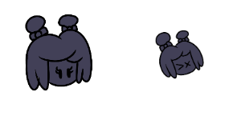

# Entry 5
## Sprites and Code. Two in one combo! 4/17/2023

With music finished, I got to the coding part of my freedom project. Now you may be asking. "But Aron, didn't you say that you are also gonna work on the sprites on the game? Why are you talking about coding now?". Great question fellow reader! There is a unique skill called [Collaboration](https://hstatsep.github.io/students/#skills) and [Commication](https://hstatsep.github.io/students/#skills). 

Dice is a fellow SEP member as well as a digital artist. She was the perfect candidate to ask for help. She gladly accepted to create the sprites for me. Although I could make the sprites myself, her art style surpassed me. You can just see the difference between my art style versus hers later on.

That being said, I need to also provide a character sheet to her so that is what exactly what I did. I made the base character sheet to give Dice a reference to draw. Here is what the character sheet looked like.

Once I sent this to Dice, I made a reasonable deadline for Dice so that she doesn't need to feel pressured into rushing. This is something I need to take into consideration. I need to make a deadline that is long enough so that the person helping doesn't feel rushed doing this while also not making it last minute. 

I gave her the 7th of April but gave her a week extension because she was very busy. It turned out to be the best since we got the amazing final product of the character sheet.

These look WAY nicer and Dice took my artwork and turn them into Friday Night Funkin style while maintaining parts of my Artwork. I've also asked her to turn these into transparent PNG because the next step requires transparent PNGs in order for the spritesheet converter to work. 

With the transparent PNG's, I turned over to the converter that I will be using. This is the [Spritesheet and XML generator](https://gamebanana.com/tools/7136) by [UncertainProductions](https://gamebanana.com/members/1895791). He made this tool to easily convert your sprites into a spritesheet and their XML file so that the game can read the spritesheet without needing Adobe Animate. On top of that, he uploaded a [tutorial](https://youtu.be/lcxpa7Gc3i0) on how to use his tool which I watched. Once converted, this is what it looks like.

And here is what the icons look like...

Of course, there are some issues with this. The icon image on the right is smaller than the left one and the spritesheets are missing its animation. The icon image can be a easy fix but I can pass the animation to my **Beyond MVP**, the game can function without animation. 

Surely with that out of the way, we can just place the spritesheet and the icons in their respective folders and be on our way right?

**WRONG**

[Previous](entry04.md) | [Next](entry06.md)

[Home](../README.md)