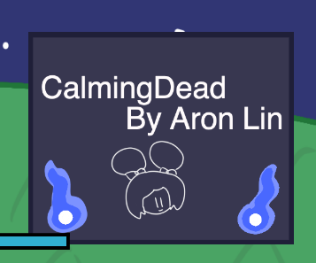
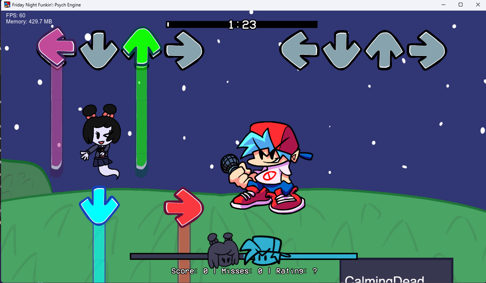
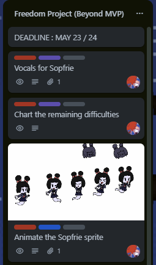

# Entry 6
## The End. Time for the Expo and lets conclude here! 5/25/2023

## Beyond MVP

After Entry 5, I had some time to do my Beyond MVP. This means I can add more features that can further enhance my project. I added the new song introduction which was way better than just a standard text popping up showing the song name. 

**Before**

```lua
function onSongStart()
    if songName == "calmingdead" then
        makeLuaText("songintro","CalmingDead by TRGGB2", 400, 800, 600)
        setTextSize("songintro", 30)
        addLuaText("songintro")
    end
end

function onUpdate(elapsed) -- On FPS 
    if curStep == 30 then
        removeLuaText("songintro" , destroy == false)
    end
end
```

**After**
```lua
function onSongStart() -- Execute the code as soon as the song starts
    if songName == "calmingdead" then -- Checks if the song matches the one your playing on
        makeLuaSprite("decal_calmingdead", "calmingdeaddecal",1300,2000) -- Make the image
        addLuaSprite("decal_calmingdead",true) -- Spawns the image
    end
end

function onUpdate(elapsed) -- Think of this like function draw() in P5JS
    if curStep == 1 then
        doTweenY("decal_calmingdead", "decal_calmingdead",900,1,linear) -- Move the image upward
    elseif curStep == 30 then
        doTweenX("decal_calmingdead", "decal_calmingdead",2000,1,linear) -- Move the image to the right. Making it disappear!
    end
end
```

This resulted in this little image showing up once the game starts and moving away after a few seconds.



I used [ShadowMario's sprite documentation](https://github.com/ShadowMario/FNF-PsychEngine/wiki/Lua-Script-API:-Custom-Sprites-Functions) on how to add this image. This also extends to how I was able to add a background to my game. Sadly the documentation doesn't show you how to add a background to the stage. After some [googling](https://hstatsep.github.io/students/#skills), I found the solution. 

[BrightEmerald](https://gamebanana.com/members/1884930), the submitter for this [script](https://gamebanana.com/tuts/14716) has a tutorial on how to use his custom lua script to spawn the background into the stage. Once I know this, I read the tutorial and pasted his script into my mod. I adjusted the values for the sprites so the background can align correctly with my character with the background.

After tweaking the values, this is the result.



Now I did went to attempt the other 3 Beyond MVP's but I had to took into [consideration](https://hstatsep.github.io/students/#skills) about the presentation. I had to get that done as well so there was no way I can do my other 2 Beyond MVP's. The other Beyond MVP was animating the sprite which I had assigned Dice to do. However, she was extremely busy and couldn't animate the sprite so I had to sadly pass that as well. 



This wasn't a huge loss though as these aren't important to make the game run functionally though! I could add these features next time.

With Beyond MVP concluded, lets talk about the presentation!

## Presentation

**[Go to Presentation](https://docs.google.com/presentation/d/15odSF1TtFE_rqf7br42ADlkGIHSujkfWkqdgPM61UbU/edit?usp=sharing)**

With all projects, there is a time where we need to present our projects. That is where presentations come in. I had to keep the projects minimally viable so that I don't spend too much slide perfecting a single slide or 2. This means that most of my slides are just basically simple colors and just information on the slide.

Luckily, I had time left so I used that time to put some finishing touches to the presentation such as images and color. This gave the presentation some extra touches to make it look stunning to look at. 

When it was time to present, I noticed some big flaws when presenting. One of which was the presentation was way to long. The presentation took nearly 20 minutes. This sadly drew away the attention of some students which is not a good sign. Second is that my energy is all over the place. There are some moments where there is a hype and serious moment but it was all over the place.

I definitely could remove some slides that are pretty much unnecessary to shorten the presentation length as well as keeping the hype and the seriousness of the presentation at a consistancy. There should be a middle ground where I can show these. 

## Expo


[Previous](entry05.md) | [Next](entry07.md)

[Home](../README.md)